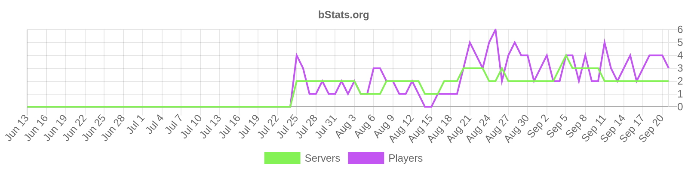

# LonelyFishing 
# 🚀 Minecraft 1.8-26.2 全版本 钓鱼插件 🚀

## 插件功能
用户可以在配置文件中 **自定义鱼竿/ 钓上的鱼/ 钓上鱼后获得的金币(Vault)/点券(PlayerPoints)/经验/自定义变量**

鱼竿可以设定**上钩率/ 能钓上的鱼/ 金币/点券/经验/自定义变量 的获取倍率**

<ins> 甚至可以设置一些**lore识别**的**额外属性**! </ins>

**额外属性:**

- 增加上钩率

- 加快钓鱼速度

- 增加钓上鱼后的窗口时间

- 增加钓上鱼的条数 以及对应的概率
## 插件特色

插件完全适配 **1.8~26.2全版本** 并呈现出良好的适配性

插件配置文件的注释讲解 以及插件开源代码中的注释讲解 **极度完善**

插件具有高度<ins>**自定义性**</ins>

- 自定义发送消息

- 自定义钓鱼获取变量

- 自定义lore识别

- 自定义鱼竿

- 自定义鱼

同时 该插件适配两大流行物品库 **MythicMobs物品库** 和 **NeigeItems物品库** 所有物品的获取均基于这两个物品库

**MythicMobs物品库:** https://mythiccraft.io/index.php?resources/mythicmobs.1/

**NeigeItems物品库:** https://github.com/ankhorg/NeigeItems-Kotlin/releases

